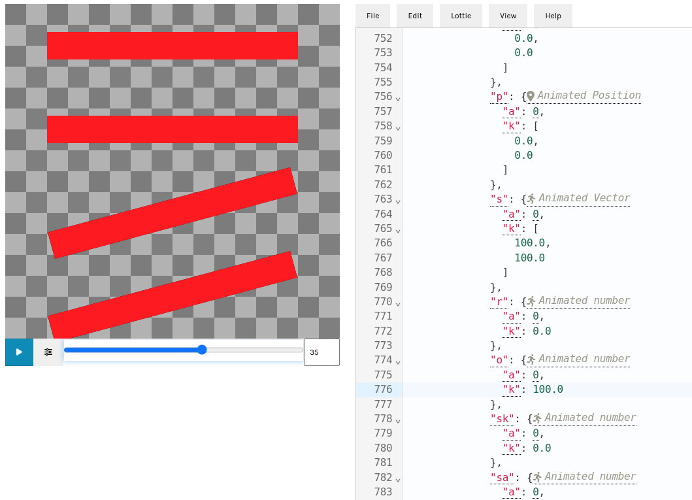

# iconimation
Exploratory hacking around use of a template Lottie to animate a font glyph

Don't count on anything working correctly.

## Usage

1. Find an icon font
   * Perhaps via https://fonts.google.com/icons?
1. Find the codepoint of the icon
   * If using fonts.google.com, click the icon and look for the heading "Code point" in the right hand pane
1. Obtain an icon font binary
   * `git clone git@github.com:google/material-design-icons.git` perhaps
1. Replace a placeholder in the template with an icon

    ```shell
    # Example assumes that:
    # 1) We are in the root of this repo
    # 2) git@github.com:google/material-design-icons.git is cloned sibling to current directory
    # 3) git@github.com:rsheeter/bodymovin-rs.git is cloned sibling to the current directory
   

    # I definitely need a Lottie that doesn't do anything!
    $ --codepoint 0xeba8 --font ../material-design-icons/font/MaterialIconsOutlined-Regular.otf --animation still

    # A spin perhaps?
    $ --codepoint 0xeba8 --font ../material-design-icons/font/MaterialIconsOutlined-Regular.otf --animation twirl
    ```

1. Try it out
   * https://lottiefiles.github.io/lottie-docs/playground/json_editor/ perhaps

   